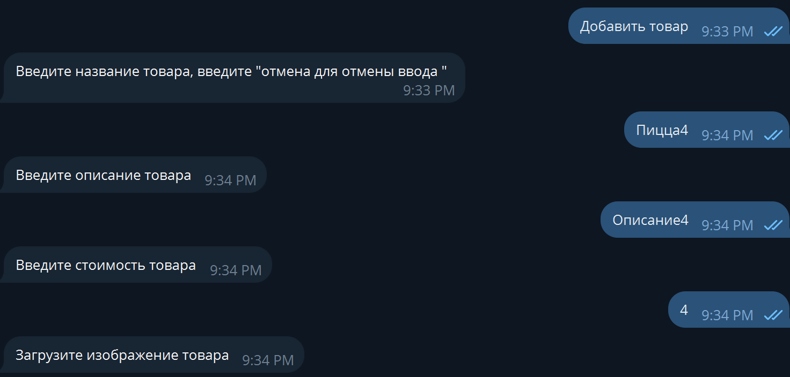

# Небольшой учебный бот какой-то пицерии.

Умеет показывать товар, а также редактирование, добавление и удаление через админку.
Всё работает через БД.

## Запуск Бота

настройка .env 

**TOKEN** токен бота

**DB_LITE** настройка БД


создание виртуальной среды
```bash
python -m venv venv
```
активация виртуальной среды
```bash
.\venv\Scripts\activate
```
установка зависимостей
```bash
pip install -r requirements.txt
```
запуск
```bash
py app.py
```

## Важный момент

/admin - админка. Админку можно получить если добавить бота в группу и отправить /admin. Бот удалит соообщение, и будет доступ к админке в боте.


# Работа бота


## Админка


